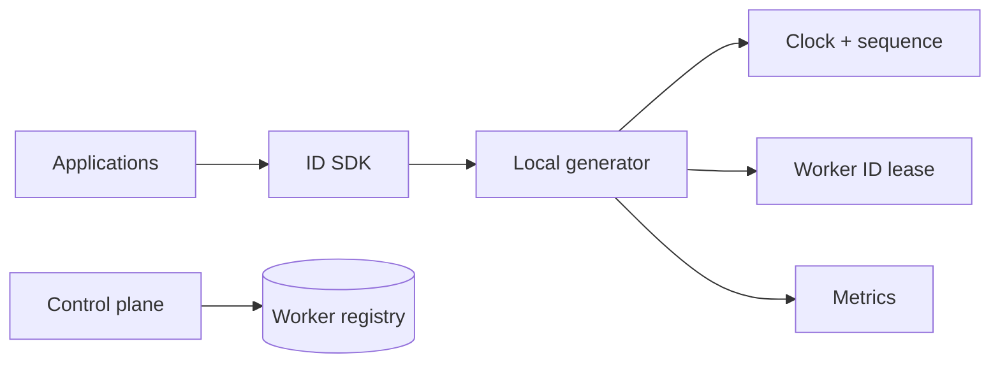
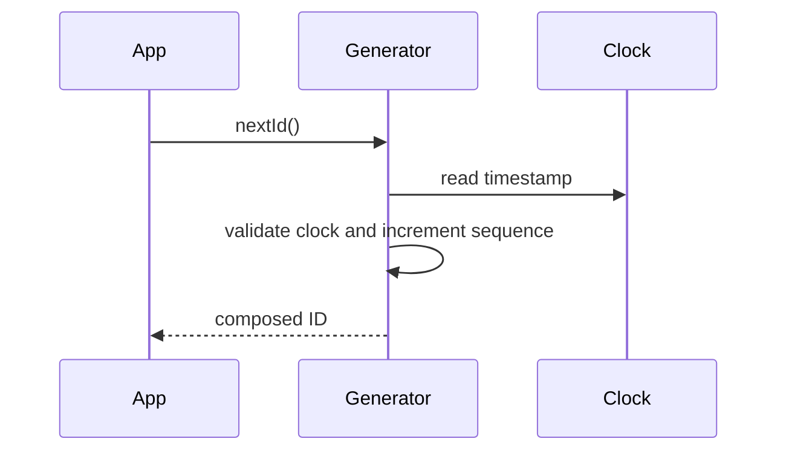
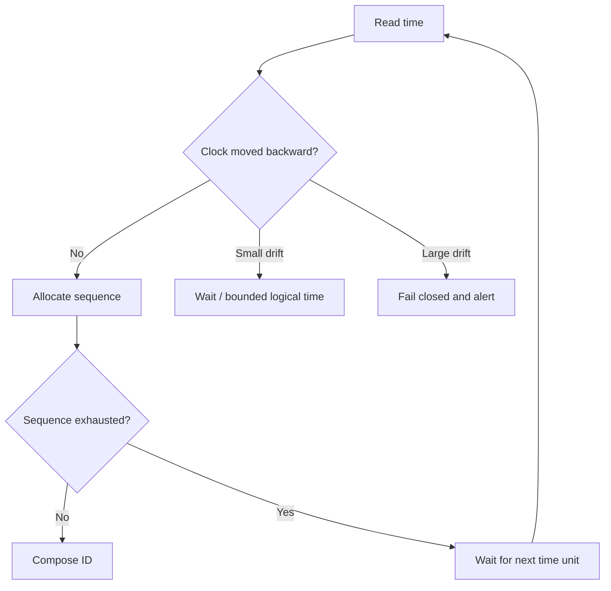

# Architecture and Diagrams

```mermaid
flowchart LR
 APP[Applications] --> SDK[ID SDK]
 SDK --> GEN[Local generator]
 GEN --> CLOCK[Clock + sequence]
 GEN --> WORKER[Worker ID lease]
 ADMIN[Control plane] --> LEASE[(Worker registry)]
 GEN --> MET[Metrics]
```

```mermaid
sequenceDiagram
 participant A as App
 participant G as Generator
 participant C as Clock
 A->>G: nextId()
 G->>C: read timestamp
 G->>G: validate clock and increment sequence
 G-->>A: composed ID
```

```mermaid
flowchart TD
 T[Read time] --> BACK{Clock moved backward?}
 BACK -->|No| SEQ[Allocate sequence]
 BACK -->|Small drift| WAIT[Wait / bounded logical time]
 BACK -->|Large drift| STOP[Fail closed and alert]
 SEQ --> FULL{Sequence exhausted?}
 FULL -->|No| ID[Compose ID]
 FULL -->|Yes| NEXT[Wait for next time unit]
 NEXT --> T
```
