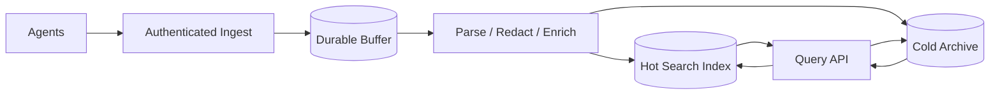

# Visual Explainer — Distributed Logging

```mermaid
flowchart LR
 AG[Agents] --> ING[Authenticated Ingest]
 ING --> Q[(Durable Buffer)]
 Q --> P[Parse / Redact / Enrich]
 P --> HOT[(Hot Search Index)]
 P --> COLD[(Cold Archive)]
 QUERY[Query API] --> HOT
 QUERY --> COLD
 HOT --> QUERY
 COLD --> QUERY
```

Acknowledge only after durable buffering; redact before indexing; query scope is tenant- and time-bounded.
