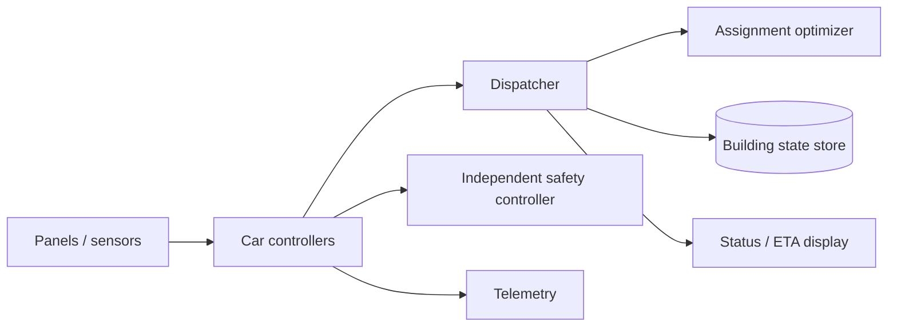
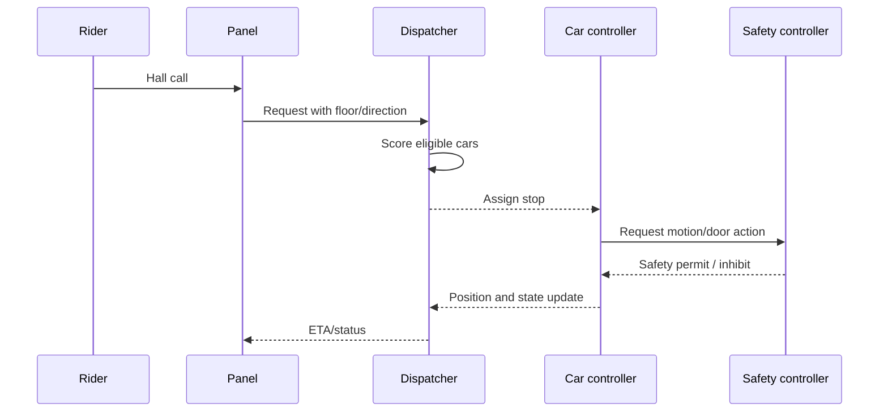
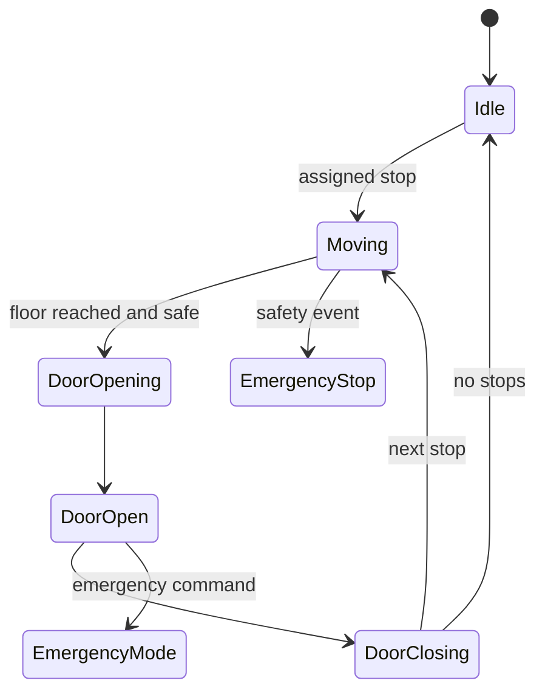

# Architecture and Diagrams

```mermaid
flowchart LR
 P[Panels / sensors] --> CTRL[Car controllers]
 CTRL --> DISP[Dispatcher]
 DISP --> ASSIGN[Assignment optimizer]
 CTRL --> SAFE[Independent safety controller]
 DISP --> STATE[(Building state store)]
 DISP --> UI[Status / ETA display]
 CTRL --> OBS[Telemetry]
```

```mermaid
sequenceDiagram
 participant R as Rider
 participant P as Panel
 participant D as Dispatcher
 participant C as Car controller
 participant S as Safety controller
 R->>P: Hall call
 P->>D: Request with floor/direction
 D->>D: Score eligible cars
 D-->>C: Assign stop
 C->>S: Request motion/door action
 S-->>C: Safety permit / inhibit
 C-->>D: Position and state update
 D-->>P: ETA/status
```

```mermaid
stateDiagram-v2
 [*] --> Idle
 Idle --> Moving: assigned stop
 Moving --> DoorOpening: floor reached and safe
 DoorOpening --> DoorOpen
 DoorOpen --> DoorClosing
 DoorClosing --> Moving: next stop
 DoorClosing --> Idle: no stops
 Moving --> EmergencyStop: safety event
 DoorOpen --> EmergencyMode: emergency command
```
