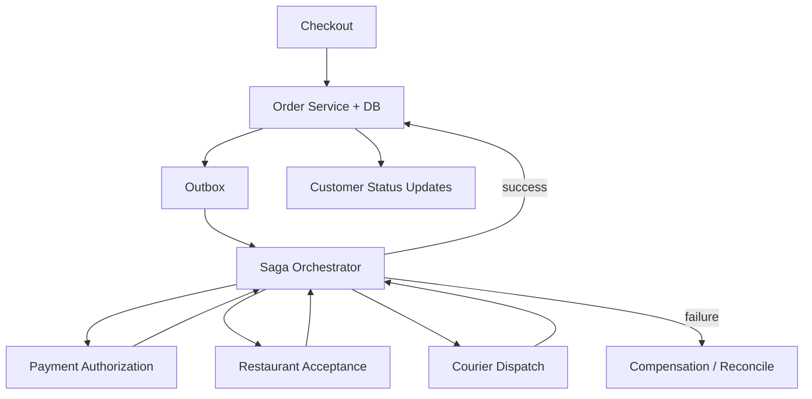

# Visual Explainer — Food Delivery

```mermaid
flowchart TD
 C[Checkout] --> O[Order Service + DB]
 O --> OB[Outbox]
 OB --> S[Saga Orchestrator]
 S --> P[Payment Authorization]
 S --> R[Restaurant Acceptance]
 S --> D[Courier Dispatch]
 P --> S
 R --> S
 D --> S
 S -->|success| O
 S -->|failure| COMP[Compensation / Reconcile]
 O --> N[Customer Status Updates]
```

Every external step is idempotent; saga state and compensation are persisted.
