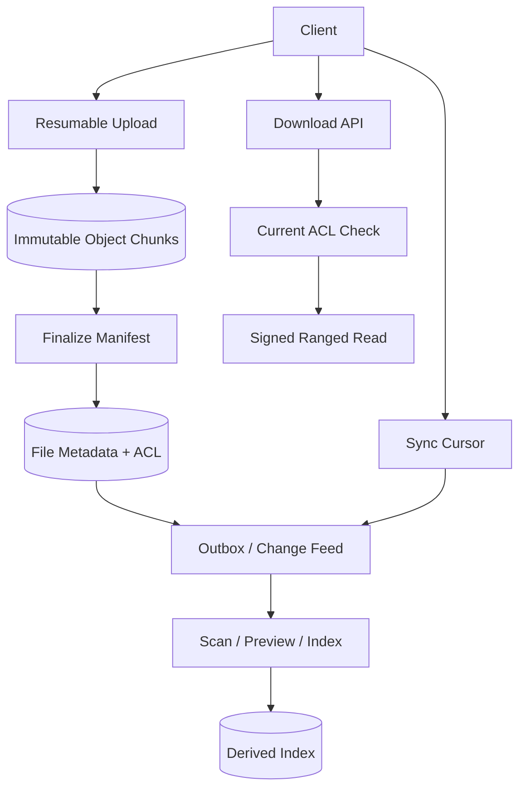

# Visual Explainer — Google Drive

```mermaid
flowchart TD
 C[Client] --> U[Resumable Upload]
 U --> O[(Immutable Object Chunks)]
 O --> F[Finalize Manifest]
 F --> DB[(File Metadata + ACL)]
 DB --> Q[Outbox / Change Feed]
 Q --> W[Scan / Preview / Index]
 W --> IDX[(Derived Index)]
 C --> SY[Sync Cursor]
 SY --> Q
 C --> DL[Download API]
 DL --> ACL[Current ACL Check]
 ACL --> CDN[Signed Ranged Read]
```

Canonical metadata and permissions are separate from object bytes and derived indexes.
