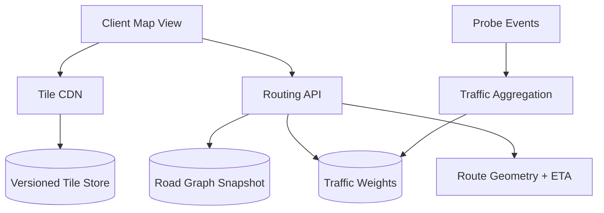

# Visual Explainer — Google Maps

```mermaid
flowchart TD
 A[Client Map View] --> T[Tile CDN]
 T --> TS[(Versioned Tile Store)]
 A --> R[Routing API]
 R --> G[(Road Graph Snapshot)]
 R --> W[(Traffic Weights)]
 R --> OUT[Route Geometry + ETA]
 P[Probe Events] --> AGG[Traffic Aggregation]
 AGG --> W
```

Routing uses a pinned graph snapshot plus time-bounded traffic weights; tiles are independently cacheable.
