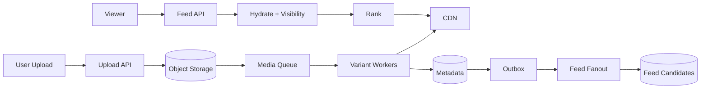

# Visual Explainer — Instagram

```mermaid
flowchart LR
 U[User Upload] --> API[Upload API]
 API --> OBJ[(Object Storage)]
 OBJ --> Q[Media Queue]
 Q --> W[Variant Workers]
 W --> CDN[CDN]
 W --> DB[(Metadata)]
 DB --> OB[Outbox]
 OB --> F[Feed Fanout]
 F --> TL[(Feed Candidates)]
 V[Viewer] --> FEED[Feed API]
 FEED --> ACL[Hydrate + Visibility]
 ACL --> R[Rank]
 R --> CDN
```

Publish only after required variants are ready; enforce ACL and story expiry during reads.
