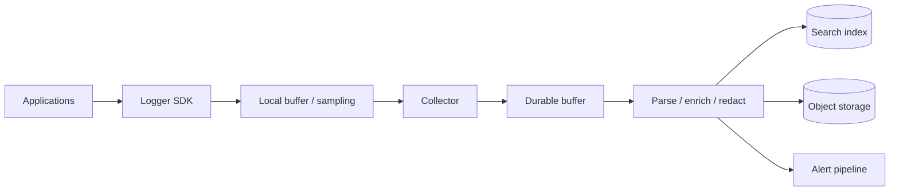
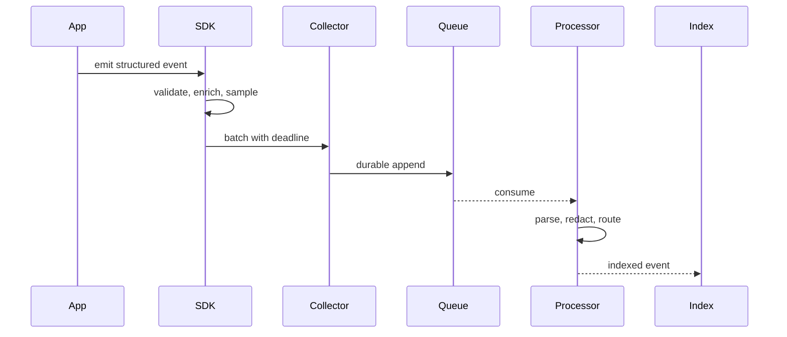
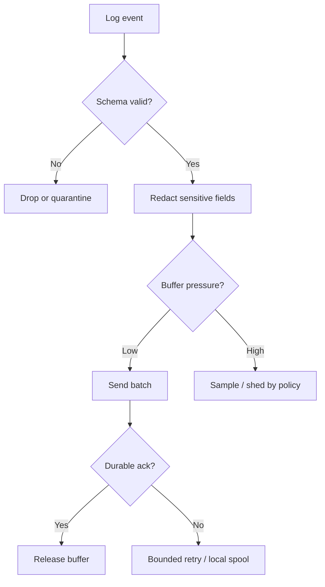

# Architecture and Diagrams

```mermaid
flowchart LR
 APP[Applications] --> SDK[Logger SDK]
 SDK --> BUF[Local buffer / sampling]
 BUF --> COL[Collector]
 COL --> Q[Durable buffer]
 Q --> PROC[Parse / enrich / redact]
 PROC --> HOT[(Search index)]
 PROC --> COLD[(Object storage)]
 PROC --> ALERT[Alert pipeline]
```

```mermaid
sequenceDiagram
 App->>SDK: emit structured event
 SDK->>SDK: validate, enrich, sample
 SDK->>Collector: batch with deadline
 Collector->>Queue: durable append
 Queue-->>Processor: consume
 Processor->>Processor: parse, redact, route
 Processor-->>Index: indexed event
```

```mermaid
flowchart TD
 E[Log event] --> VALID{Schema valid?}
 VALID -->|No| DROP[Drop or quarantine]
 VALID -->|Yes| REDACT[Redact sensitive fields]
 REDACT --> LOAD{Buffer pressure?}
 LOAD -->|Low| SEND[Send batch]
 LOAD -->|High| SAMPLE[Sample / shed by policy]
 SEND --> ACK{Durable ack?}
 ACK -->|Yes| DONE[Release buffer]
 ACK -->|No| RETRY[Bounded retry / local spool]
```
