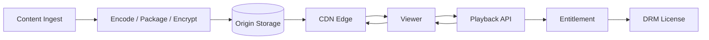

# Visual Explainer — Netflix

```mermaid
flowchart LR
 ING[Content Ingest] --> ENC[Encode / Package / Encrypt]
 ENC --> OR[(Origin Storage)]
 OR --> CDN[CDN Edge]
 C[Viewer] --> P[Playback API]
 P --> E[Entitlement]
 E --> L[DRM License]
 P --> C
 C --> CDN
 CDN --> C
```

Control plane authorizes playback; CDN data plane delivers immutable segments.
