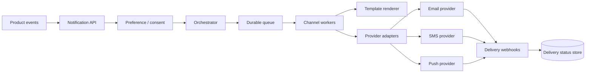
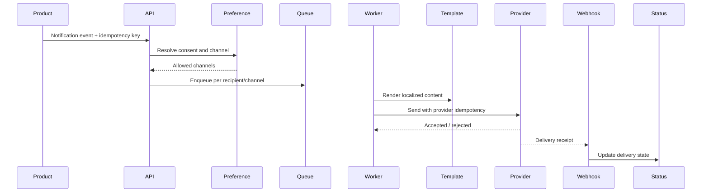
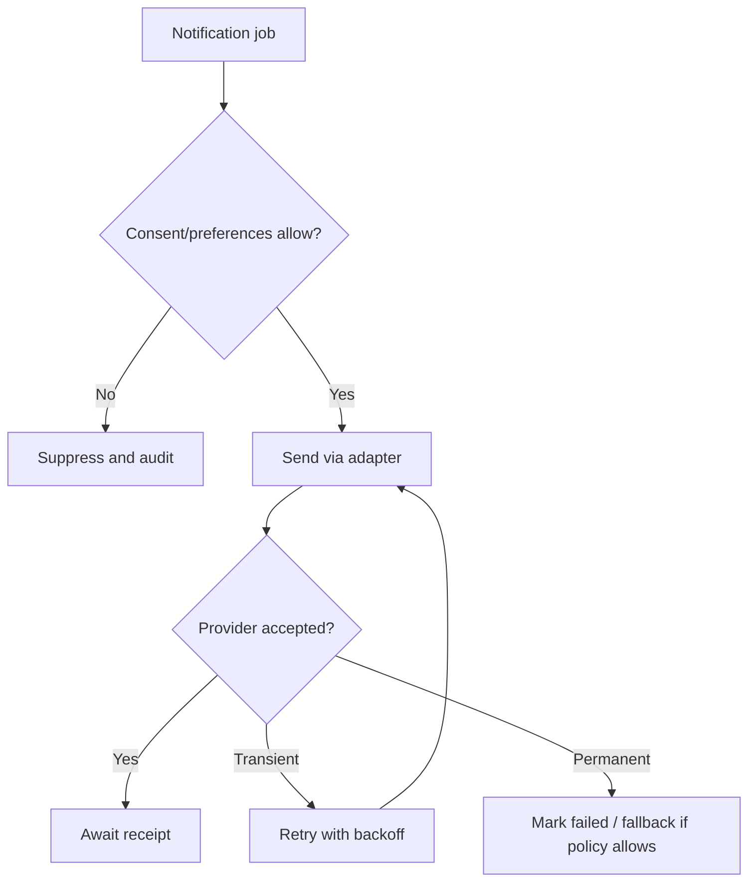

# Architecture and Diagrams

```mermaid
flowchart LR
 EVT[Product events] --> API[Notification API]
 API --> PREF[Preference / consent]
 PREF --> ORCH[Orchestrator]
 ORCH --> Q[Durable queue]
 Q --> WORK[Channel workers]
 WORK --> TMP[Template renderer]
 WORK --> ADAPT[Provider adapters]
 ADAPT --> EMAIL[Email provider]
 ADAPT --> SMS[SMS provider]
 ADAPT --> PUSH[Push provider]
 EMAIL --> WEB[Delivery webhooks]
 SMS --> WEB
 PUSH --> WEB
 WEB --> STATUS[(Delivery status store)]
```

```mermaid
sequenceDiagram
 Product->>API: Notification event + idempotency key
 API->>Preference: Resolve consent and channel
 Preference-->>API: Allowed channels
 API->>Queue: Enqueue per recipient/channel
 Worker->>Template: Render localized content
 Worker->>Provider: Send with provider idempotency
 Provider-->>Worker: Accepted / rejected
 Provider-->>Webhook: Delivery receipt
 Webhook->>Status: Update delivery state
```

```mermaid
flowchart TD
 N[Notification job] --> CONSENT{Consent/preferences allow?}
 CONSENT -->|No| SUPPRESS[Suppress and audit]
 CONSENT -->|Yes| SEND[Send via adapter]
 SEND --> OK{Provider accepted?}
 OK -->|Yes| WAIT[Await receipt]
 OK -->|Transient| RETRY[Retry with backoff]
 RETRY --> SEND
 OK -->|Permanent| FAIL[Mark failed / fallback if policy allows]
```
