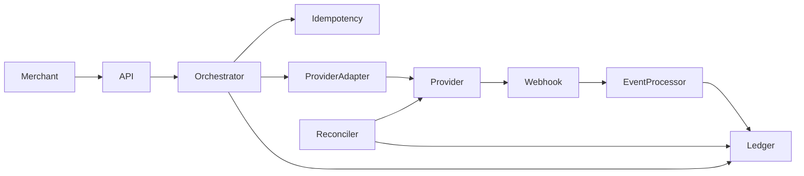
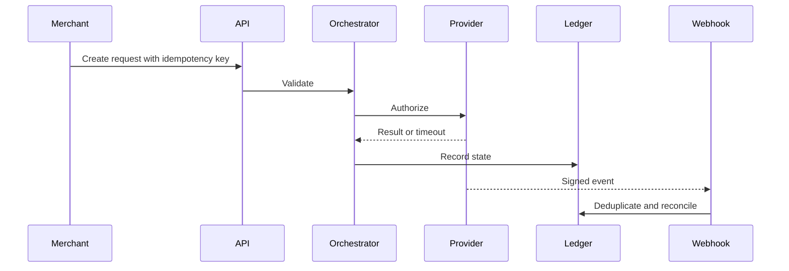

# Architecture

Components: merchant API, payment orchestrator, idempotency store, provider adapters, signed webhook processor, immutable ledger and reconciliation worker.

```mermaid
flowchart LR
 Merchant --> API --> Orchestrator
 Orchestrator --> Idempotency
 Orchestrator --> ProviderAdapter --> PSP[Provider]
 PSP --> Webhook --> EventProcessor --> Ledger
 Orchestrator --> Ledger
 Reconciler --> PSP
 Reconciler --> Ledger
```

```mermaid
sequenceDiagram
 Merchant->>API: Create request with idempotency key
 API->>Orchestrator: Validate
 Orchestrator->>Provider: Authorize
 Provider-->>Orchestrator: Result or timeout
 Orchestrator->>Ledger: Record state
 Provider-->>Webhook: Signed event
 Webhook->>Ledger: Deduplicate and reconcile
```
