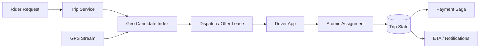

# Visual Explainer — Ride-Hailing

```mermaid
flowchart LR
 R[Rider Request] --> T[Trip Service]
 T --> G[Geo Candidate Index]
 G --> D[Dispatch / Offer Lease]
 D --> DR[Driver App]
 DR --> CAS[Atomic Assignment]
 CAS --> DB[(Trip State)]
 GPS[GPS Stream] --> G
 DB --> PAY[Payment Saga]
 DB --> ETA[ETA / Notifications]
```

Assignment is a transactional state transition; GPS/ETA are time-sensitive derived data.
