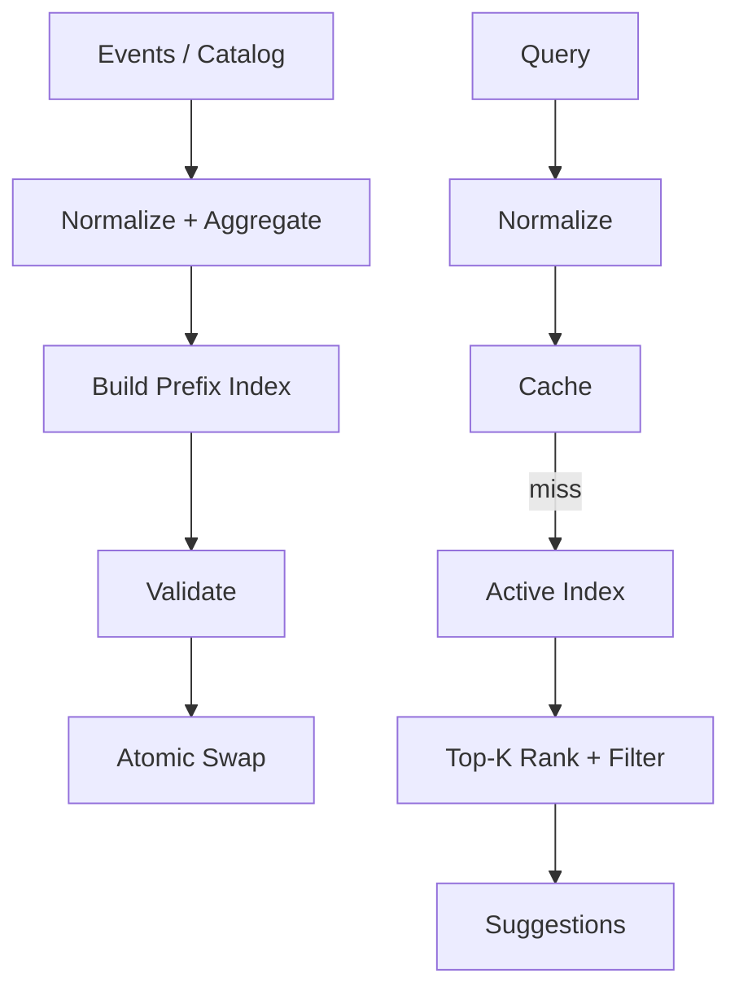

# Visual Explainer — Search Autocomplete

```mermaid
flowchart TD
 E[Events / Catalog] --> N[Normalize + Aggregate]
 N --> B[Build Prefix Index]
 B --> V[Validate]
 V --> S[Atomic Swap]
 Q[Query] --> C[Normalize]
 C --> K[Cache]
 K -->|miss| I[Active Index]
 I --> R[Top-K Rank + Filter]
 R --> O[Suggestions]
```

Keep index builds off the request path and publish only validated versions.
