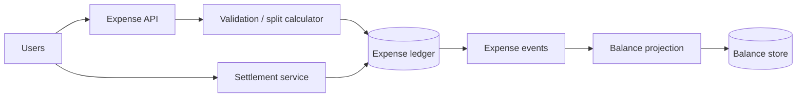
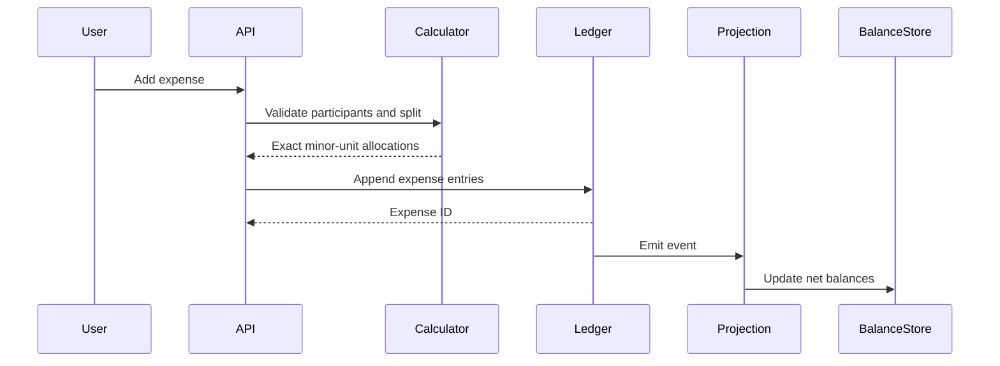
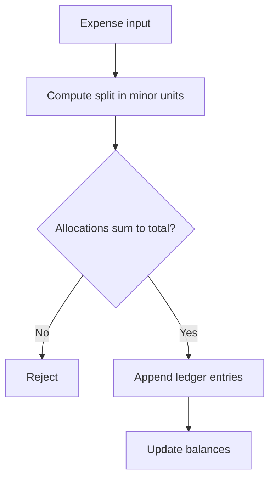

# Architecture and Diagrams

```mermaid
flowchart LR
 U[Users] --> API[Expense API]
 API --> VAL[Validation / split calculator]
 VAL --> LEDGER[(Expense ledger)]
 LEDGER --> EVT[Expense events]
 EVT --> BAL[Balance projection]
 BAL --> DB[(Balance store)]
 U --> SET[Settlement service]
 SET --> LEDGER
```

```mermaid
sequenceDiagram
 User->>API: Add expense
 API->>Calculator: Validate participants and split
 Calculator-->>API: Exact minor-unit allocations
 API->>Ledger: Append expense entries
 Ledger-->>API: Expense ID
 Ledger->>Projection: Emit event
 Projection->>BalanceStore: Update net balances
```

```mermaid
flowchart TD
 E[Expense input] --> SPLIT[Compute split in minor units]
 SPLIT --> SUM{Allocations sum to total?}
 SUM -->|No| REJECT[Reject]
 SUM -->|Yes| POST[Append ledger entries]
 POST --> PROJ[Update balances]
```
