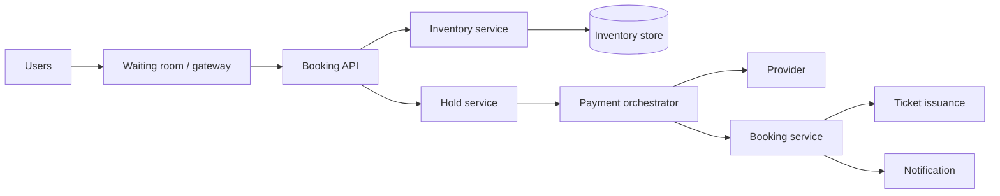
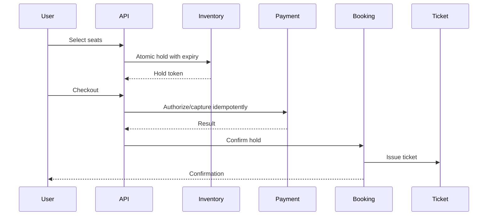
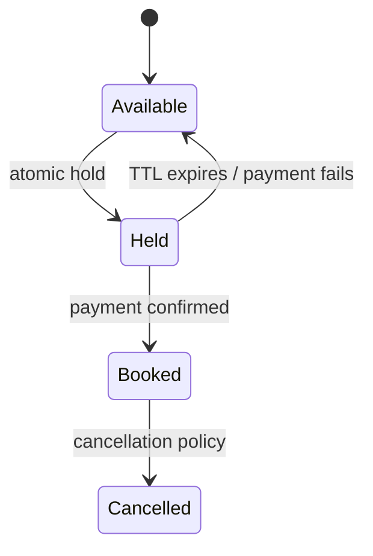

# Architecture and Diagrams

```mermaid
flowchart LR
 U[Users] --> EDGE[Waiting room / gateway]
 EDGE --> API[Booking API]
 API --> INV[Inventory service]
 INV --> DB[(Inventory store)]
 API --> HOLD[Hold service]
 HOLD --> PAY[Payment orchestrator]
 PAY --> PSP[Provider]
 PAY --> BOOK[Booking service]
 BOOK --> TKT[Ticket issuance]
 BOOK --> MSG[Notification]
```

```mermaid
sequenceDiagram
 User->>API: Select seats
 API->>Inventory: Atomic hold with expiry
 Inventory-->>API: Hold token
 User->>API: Checkout
 API->>Payment: Authorize/capture idempotently
 Payment-->>API: Result
 API->>Booking: Confirm hold
 Booking->>Ticket: Issue ticket
 Booking-->>User: Confirmation
```

```mermaid
stateDiagram-v2
 [*] --> Available
 Available --> Held: atomic hold
 Held --> Booked: payment confirmed
 Held --> Available: TTL expires / payment fails
 Booked --> Cancelled: cancellation policy
```
