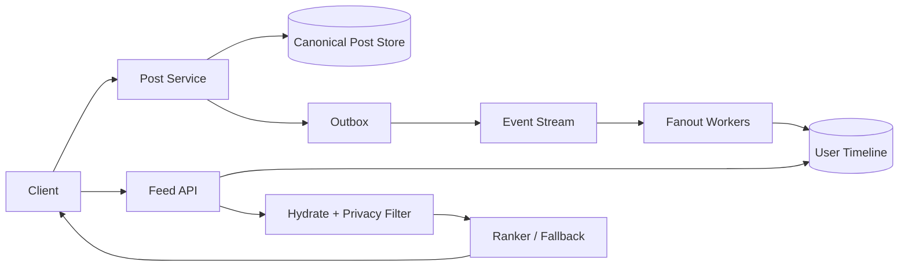

# Visual Explainer — Twitter / X

```mermaid
flowchart LR
 C[Client] --> PS[Post Service]
 PS --> DB[(Canonical Post Store)]
 PS --> OB[Outbox]
 OB --> Q[Event Stream]
 Q --> FW[Fanout Workers]
 FW --> TL[(User Timeline)]
 C --> FEED[Feed API]
 FEED --> TL
 FEED --> HYD[Hydrate + Privacy Filter]
 HYD --> R[Ranker / Fallback]
 R --> C
```

Canonical posts and relationships are source of truth; timelines, trends and ranking features are derived projections.
