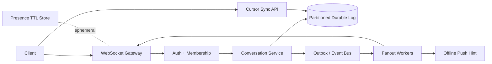

# Visual Explainer — WhatsApp-Style Messaging

```mermaid
flowchart LR
 C[Client] --> GW[WebSocket Gateway]
 GW --> AUTH[Auth + Membership]
 AUTH --> S[Conversation Service]
 S --> LOG[(Partitioned Durable Log)]
 S --> OB[Outbox / Event Bus]
 OB --> F[Fanout Workers]
 F --> GW
 F --> PUSH[Offline Push Hint]
 C --> SYNC[Cursor Sync API]
 SYNC --> LOG
 PRES[Presence TTL Store] -. ephemeral .- GW
```

Ordering is per conversation. Durable history and cursor sync recover from disconnects; presence and push are advisory.
